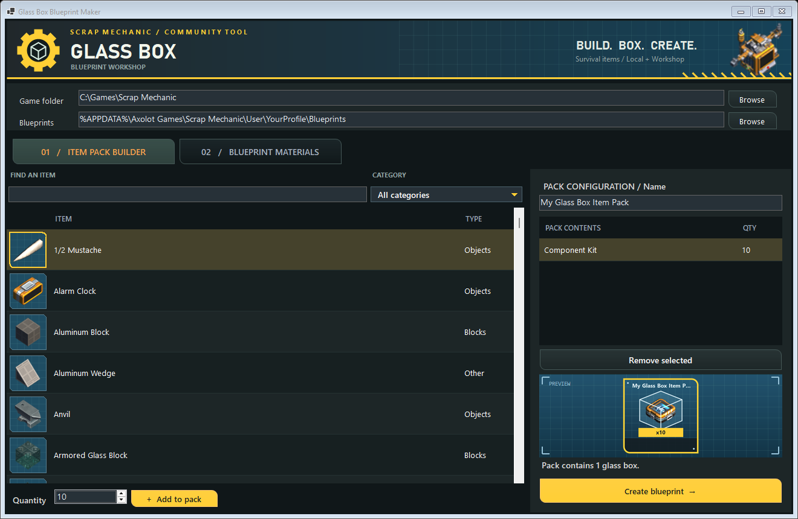
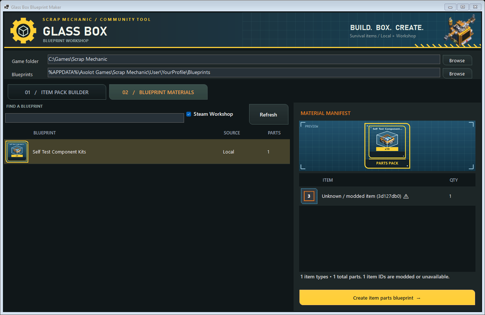

# Glass Box Blueprint Maker

A standalone Windows app for creating Scrap Mechanic Survival cheat blueprints. It reads the
installed game's `survival_items.lua`, English item names, and the official inventory icon
atlases, then creates one connected glass cube per selected item stack. It can also inspect
existing blueprints and build a boxed item pack containing all of their construction parts.

## Download v1.3.3

Download the Windows x64 ZIP from [the latest release](https://github.com/masterjobberman/Scrap-Mechanic-Blueprint-Tool/releases/latest), extract it, and run `GlassBoxBlueprintMaker.exe`. The package includes its .NET runtime; Scrap Mechanic must be installed for its item catalogue and artwork.

## What's new

- Scrap Mechanic-inspired workshop design: blue drafting grids, yellow highlights, curved panels, and themed item cards.
- Matching preview icons, with the item-pack title taken from **Pack Configuration / Name** and refreshed as you type.
- Safer quantity handling, clearer empty states, and more reliable library refreshes.
- Improved layouts at 1320 × 860 and the 1040 × 760 minimum window size.

See [CHANGELOG.md](CHANGELOG.md) for the full changes and verification details.

## Screenshots

Screenshots use a temporary sample blueprint and generic paths; they contain no personal library listing.

### Item Pack Builder



### Blueprint Materials



## Use

1. Run `GlassBoxBlueprintMaker.exe`.
2. Confirm the automatically detected Scrap Mechanic and Blueprints folders.
3. In **Item Pack Builder**, search or filter the item list, choose a quantity, and click
   **Add to pack**.
4. Enter a name under **Pack Configuration / Name** and click **Create blueprint**. The preview and exported icon use that name.
5. Or open **Blueprint Materials**, select a local or subscribed Workshop blueprint, review
   its material list, and click **Create item parts blueprint**.

Each output is a new UUID folder containing only `blueprint.json`, `description.json`, and a
generated 128x128 blue-and-yellow `icon.png`. The app never overwrites an existing blueprint.

Material packs keep the selected blueprint's name with ` Item Parts` added to the end. They
also display its original artwork inside a matching blue-and-yellow parts frame. Scalable
blocks are counted from their full bounds; individual parts and joints are counted separately.

Subscribed Steam Workshop creations are supported when the Workshop item contains a normal
`blueprint.json` at its top level. Maps, challenges, and other uploads without that file are
ignored. Unknown modded UUIDs remain listed and can be boxed, but the receiving game must have
the required mods installed.

The receiving PC needs Scrap Mechanic installed so the app can read its current item catalogue
and icons. If Steam is installed in a non-standard library, select the game folder once in the
app. This build targets 64-bit Windows and carries its own .NET runtime.


## Build and verify

Requires a Windows .NET SDK capable of building `net9.0-windows`.

```powershell
dotnet publish -c Release -o publish
.\publish\GlassBoxBlueprintMaker.exe --self-test
```

The self-test requires an installed game and a populated local blueprint library. If a Workshop folder is found, it also expects a supported Workshop blueprint. It writes `self-test-result.txt` and screenshots under `ui-verification` beside the executable, and creates temporary test blueprints that it removes afterwards. It does not launch Scrap Mechanic or verify in-game spawning.

This is a community tool. Game artwork is loaded from the local game installation and remains the property of its respective owner.

